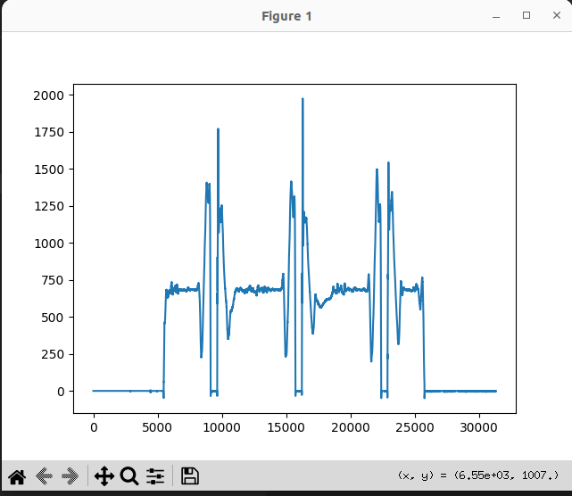
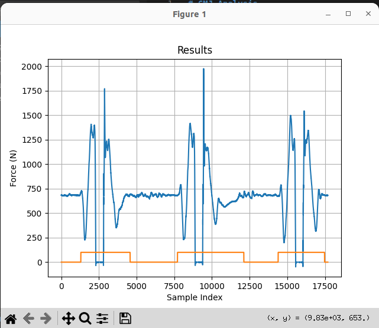
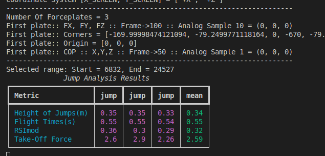

# CMJ Analysis

Using this python script you can compute Height of Jump, Fight time, RSImod and etc.You just need to capture your forceplate data in a C3D file.

# Install Python Packages

```python
    pip install pyc3dtools matplotlib rich
```

# Run script

```python
    python main.py --arg1 C3DFilePath --arg2 ForceplateNumber

    python main.py --arg1 ./data/FPCMJ.c3d --arg2 2 #Sample file

```

Then if the c3d file read correctlly, a plot will be opened you can select the relevent zone by drag, just remember the mass of subject calculat based on 100 first sample data points.</br>



Processed signal:</br>



Now you can see the results in terminal:</br>

